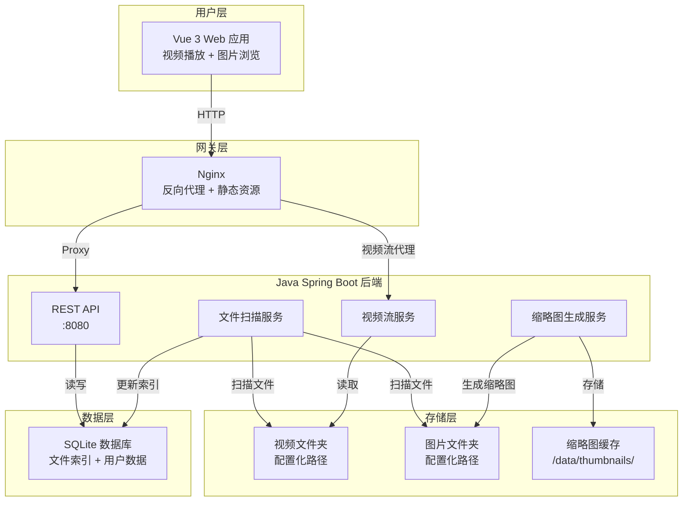
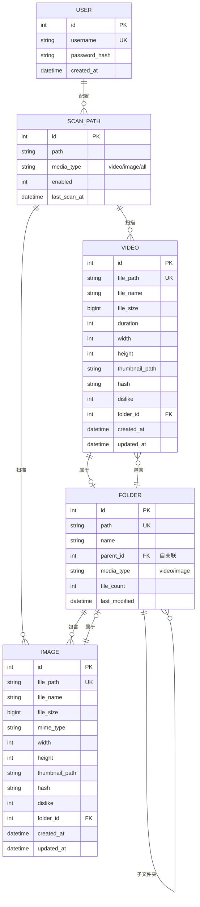

# 视频图片文件管理系统 - 系统架构设计

> 项目名称：Video & Image Manager
> 版本：v2.0（视频+图片管理）
> 日期：2026-04-19
> 作者：码哥

---

## 1. 系统架构图



---

## 2. 技术栈选型

| 层级 | 技术 | 说明 |
|------|------|------|
| **前端** | Vue 3 + Vite | 现代前端框架，快速构建 |
| **UI组件** | Element Plus | Vue3 组件库 |
| **状态管理** | Pinia | Vue3 官方推荐 |
| **视频播放** | video.js / Vue3VideoPlayer | 类抖音上下滑动 |
| **图片预览** | v-viewer | 图片预览+缩略图 |
| **后端** | Java 17 + Spring Boot 3 | 您精通，稳定可靠 |
| **ORM** | MyBatis-Plus | 轻量级 ORM |
| **数据库** | SQLite | 零配置，适合 NAS |
| **缩略图** | Thumbnailator | Java 图片处理 |
| **认证** | JWT | 无状态登录 |
| **容器** | Docker + Docker Compose | 一键部署 |

---

## 3. 项目目录结构

```
video-manager/
├── backend/                          # Java 后端
│   ├── src/main/java/
│   │   └── com/videomanager/
│   │       ├── VideoManagerApplication.java
│   │       ├── config/               # 配置类
│   │       │   ├── SecurityConfig.java
│   │       │   ├── CorsConfig.java
│   │       │   ├── SqliteConfig.java
│   │       │   └── AsyncConfig.java
│   │       ├── controller/           # REST API
│   │       │   ├── AuthController.java
│   │       │   ├── VideoController.java
│   │       │   ├── ImageController.java
│   │       │   ├── FolderController.java
│   │       │   ├── ScanPathController.java
│   │       │   └── ScanController.java
│   │       ├── service/              # 业务逻辑
│   │       │   ├── AuthService.java
│   │       │   ├── VideoService.java
│   │       │   ├── ImageService.java
│   │       │   ├── ScanService.java
│   │       │   ├── ThumbnailService.java
│   │       │   └── FileService.java
│   │       ├── entity/               # 数据实体
│   │       │   ├── User.java
│   │       │   ├── Video.java
│   │       │   ├── Image.java
│   │       │   ├── ScanPath.java
│   │       │   └── Folder.java
│   │       ├── mapper/               # MyBatis 映射
│   │       ├── dto/                  # 数据传输对象
│   │       └── util/                 # 工具类
│   ├── src/main/resources/
│   │   ├── application.yml
│   │   └── schema.sql
│   ├── pom.xml
│   └── Dockerfile
│
├── frontend/                         # Vue 前端
│   ├── src/
│   │   ├── api/                     # API 调用
│   │   │   ├── video.js
│   │   │   ├── image.js
│   │   │   └── scan.js
│   │   ├── components/              # 组件
│   │   │   ├── VideoPlayer.vue       # 抖音式播放器
│   │   │   ├── VideoList.vue         # 视频列表
│   │   │   ├── VideoCard.vue         # 视频卡片
│   │   │   ├── ImageGrid.vue         # 图片网格
│   │   │   ├── ImageList.vue         # 图片列表
│   │   │   ├── ImagePreview.vue      # 图片预览弹窗
│   │   │   ├── FolderTree.vue        # 文件夹树
│   │   │   ├── FolderBreadcrumb.vue  # 文件夹面包屑
│   │   │   ├── ViewModeToggle.vue   # 视图切换
│   │   │   ├── MediaFilter.vue       # 筛选组件
│   │   │   └── Sidebar.vue
│   │   ├── views/                   # 页面
│   │   │   ├── Login.vue
│   │   │   ├── Home.vue              # 首页/仪表盘
│   │   │   ├── VideoPlayer.vue       # 全屏播放器
│   │   │   ├── VideoList.vue         # 视频列表页
│   │   │   ├── ImageList.vue         # 图片列表页
│   │   │   ├── ImageGrid.vue         # 图片网格页
│   │   │   └── Settings.vue          # 设置页
│   │   ├── stores/                  # Pinia 状态管理
│   │   │   ├── user.js
│   │   │   ├── video.js
│   │   │   └── image.js
│   │   ├── router/                  # Vue Router
│   │   │   └── index.js
│   │   ├── styles/                  # 全局样式
│   │   │   └── main.css
│   │   ├── App.vue
│   │   └── main.js
│   ├── public/
│   ├── package.json
│   ├── vite.config.js
│   └── Dockerfile
│
├── scripts/                           # 脚本
│   └── init-db.sh                   # 数据库初始化
│
├── docs/                             # 项目文档
│   ├── ARCHITECTURE.md
│   └── PRD.md
│
├── data/                             # 数据持久化
│   ├── video-manager.db             # SQLite 数据库
│   └── thumbnails/                  # 缩略图缓存
│       ├── video/                   # 视频缩略图
│       └── image/                   # 图片缩略图
│
├── docker-compose.yml                # Docker 部署配置
├── nginx.conf                       # Nginx 反向代理配置
└── README.md                        # 项目说明
```

---

## 4. 数据库设计（SQLite）

### 4.1 ER 图



### 4.2 表结构 SQL

```sql
-- 用户表
CREATE TABLE user (
    id INTEGER PRIMARY KEY AUTOINCREMENT,
    username TEXT UNIQUE NOT NULL,
    password_hash TEXT NOT NULL,
    created_at DATETIME DEFAULT CURRENT_TIMESTAMP
);

-- 扫描路径配置表
CREATE TABLE scan_path (
    id INTEGER PRIMARY KEY AUTOINCREMENT,
    path TEXT NOT NULL,
    media_type TEXT DEFAULT 'all',
    enabled INTEGER DEFAULT 1,
    last_scan_at DATETIME,
    created_at DATETIME DEFAULT CURRENT_TIMESTAMP
);

-- 视频文件索引表
CREATE TABLE video (
    id INTEGER PRIMARY KEY AUTOINCREMENT,
    file_path TEXT UNIQUE NOT NULL,
    file_name TEXT NOT NULL,
    file_size INTEGER,
    duration INTEGER,
    width INTEGER,
    height INTEGER,
    thumbnail_path TEXT,
    hash TEXT,
    dislike INTEGER DEFAULT 0,
    folder_id INTEGER,
    created_at DATETIME DEFAULT CURRENT_TIMESTAMP,
    updated_at DATETIME DEFAULT CURRENT_TIMESTAMP,
    FOREIGN KEY (folder_id) REFERENCES folder(id)
);

-- 图片文件索引表
CREATE TABLE image (
    id INTEGER PRIMARY KEY AUTOINCREMENT,
    file_path TEXT UNIQUE NOT NULL,
    file_name TEXT NOT NULL,
    file_size INTEGER,
    mime_type TEXT,
    width INTEGER,
    height INTEGER,
    thumbnail_path TEXT,
    hash TEXT,
    dislike INTEGER DEFAULT 0,
    folder_id INTEGER,
    created_at DATETIME DEFAULT CURRENT_TIMESTAMP,
    updated_at DATETIME DEFAULT CURRENT_TIMESTAMP,
    FOREIGN KEY (folder_id) REFERENCES folder(id)
);

-- 文件夹信息表
CREATE TABLE folder (
    id INTEGER PRIMARY KEY AUTOINCREMENT,
    path TEXT UNIQUE NOT NULL,
    name TEXT NOT NULL,
    parent_id INTEGER,
    media_type TEXT DEFAULT 'all',
    file_count INTEGER DEFAULT 0,
    folder_count INTEGER DEFAULT 0,
    last_modified DATETIME,
    created_at DATETIME DEFAULT CURRENT_TIMESTAMP,
    FOREIGN KEY (parent_id) REFERENCES folder(id)
);

-- 索引
CREATE INDEX idx_video_hash ON video(hash);
CREATE INDEX idx_video_dislike ON video(dislike);
CREATE INDEX idx_video_folder ON video(folder_id);
CREATE INDEX idx_image_hash ON image(hash);
CREATE INDEX idx_image_dislike ON image(dislike);
CREATE INDEX idx_image_folder ON image(folder_id);
CREATE INDEX idx_folder_parent ON folder(parent_id);
```

---

## 5. API 接口设计

### 5.1 认证模块

| 方法 | 接口 | 说明 |
|------|------|------|
| POST | `/api/auth/register` | 用户注册 |
| POST | `/api/auth/login` | 用户登录 |
| POST | `/api/auth/logout` | 用户登出 |
| GET | `/api/auth/me` | 获取当前用户 |

### 5.2 视频管理

| 方法 | 接口 | 说明 |
|------|------|------|
| GET | `/api/videos` | 列表（分页筛选） |
| GET | `/api/videos/{id}` | 详情 |
| GET | `/api/videos/random` | 随机一个 |
| PUT | `/api/videos/{id}/dislike` | 标记不喜欢 |
| DELETE | `/api/videos/{id}` | 删除记录 |
| DELETE | `/api/videos/dislikes` | 批量删除 |
| GET | `/api/videos/stream/{id}` | 视频流 |
| GET | `/api/videos/thumb/{id}` | 缩略图 |

### 5.3 图片管理

| 方法 | 接口 | 说明 |
|------|------|------|
| GET | `/api/images` | 列表（分页筛选） |
| GET | `/api/images/{id}` | 详情 |
| PUT | `/api/images/{id}/dislike` | 标记不喜欢 |
| DELETE | `/api/images/{id}` | 删除记录 |
| DELETE | `/api/images/dislikes` | 批量删除 |
| GET | `/api/images/thumb/{id}` | 缩略图 |
| GET | `/api/images/raw/{id}` | 原图 |
| GET | `/api/images/preview` | 预览（多图） |

### 5.4 文件夹管理

| 方法 | 接口 | 说明 |
|------|------|------|
| GET | `/api/folders` | 文件夹树 |
| GET | `/api/folders/{id}/children` | 子项 |
| DELETE | `/api/folders/empty` | 删除空文件夹 |

### 5.5 扫描管理

| 方法 | 接口 | 说明 |
|------|------|------|
| GET | `/api/scan/paths` | 路径列表 |
| POST | `/api/scan/paths` | 添加路径 |
| PUT | `/api/scan/paths/{id}` | 更新路径 |
| DELETE | `/api/scan/paths/{id}` | 删除路径 |
| POST | `/api/scan/start` | 触发扫描 |
| GET | `/api/scan/status` | 扫描状态 |
| POST | `/api/scan/stop` | 停止扫描 |

### 5.6 统计

| 方法 | 接口 | 说明 |
|------|------|------|
| GET | `/api/stats/overview` | 统计概览 |
| GET | `/api/stats/duplicates` | 重复文件 |

---

## 6. 核心功能

### 6.1 类抖音视频播放器

快捷键：

| 按键 | 功能 |
|------|------|
| ↑ | 上一视频 |
| ↓ | 下一视频 |
| ← | 快退10秒 |
| → | 快进10秒 |
| 空格 | 播放/暂停 |
| X | 标记不喜欢 |
| D | 删除 |
| F | 全屏 |
| M | 静音 |
| ESC | 退出 |

### 6.2 图片浏览器

视图模式：
- **网格视图**：缩略图网格，点击放大
- **列表视图-保留层级**：显示文件夹树结构
- **列表视图-平铺所有**：所有文件平铺显示

预览模式：
- 点击图片放大
- 左右箭头切换
- X 标记不喜欢

### 6.3 缩略图生成

| 类型 | 策略 | 尺寸 |
|------|------|------|
| 视频 | FFmpeg 提取 | 320x180 |
| 图片 | Thumbnailator | 320x320 |

---

## 7. Docker 部署

```yaml
services:
  backend:
    build: ./backend
    ports:
      - "8080:8080"
    volumes:
      - ./data:/app/data
      - /path/to/videos:/mnt/videos:ro
      - /path/to/images:/mnt/images:ro

  frontend:
    build: ./frontend
    ports:
      - "80:80"
```

---

## 8. 支持媒体格式

### 视频
.mp4, .avi, .mkv, .mov, .wmv, .flv, .webm, .m4v

### 图片
.jpg, .jpeg, .png, .gif, .bmp, .webp, .svg, .heic
